# Linux基础知识+InternStudio介绍

官方详细文档：[InternStudio介绍](https://aicarrier.feishu.cn/wiki/GQ1Qwxb3UiQuewk8BVLcuyiEnHe)

官网地址：[书生·浦语官网](https://internlm.intern-ai.org.cn/)  

# 1.笔记

**浦语模型大世纪：前不久InternLM2.5重磅发布，恭喜恭喜，InternLM2.5 在 WAIC 24 上开源啦～，InternLM2.5-7B-Chat 登顶 Hugging Face OpenLLM Leaderboard  12B 以下榜首，性能比肩 Llama 3 70B～**

https://zhuanlan.zhihu.com/p/707065312

> - **推理能力大幅提升**
> - **有效支持百万字超长上下文**
> - **工具调用能力整体升级**
>

https://github.com/internLM/InternLM

**一、我们先简单了解什么是SSH和端口映射**

SSH全称Secure Shell，中文翻译为安全外壳，它是一种**网络安全协议**，通过加密和认证机制实现安全的访问和文件传输等业务。SSH 协议通过对网络数据进行加密和验证，在不安全的网络环境中提供了安全的网络服务。

SSH 是（C/S架构）由**服务器**和**客户端**组成，为建立安全的 SSH 通道，双方需要先建立 TCP 连接，然后协商使用的版本号和各类算法，并生成相同的**会话密钥**用于后续的对称加密。在完成用户认证后，双方即可建立会话进行数据交互。

后面实践中会配置SSH密钥，是为了不让我们远程连接开发开发机重复输入密码。

远程连接的好处就是办公的时候，需要执行一些办公电脑环境的代码就很方便了，不需要本地配置这么麻烦。

**二、怎么使用SSH远程连接开发机**

我们先进行SSH密钥配置，在本地打开powershell终端，使用**win+R**打开运行框输入`cmd`，使用**`ssh-keygen`**命令来生成密钥。

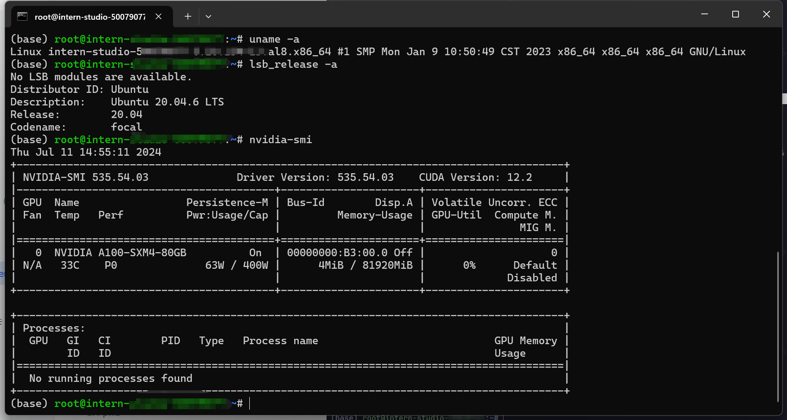

**ssh-keygen**支持RSA和DSA两种认证密钥。

> 常用参数包括：
>
> - -t：指定密钥类型，如dsa、ecdsa、ed25519、rsa。
> - -b：指定密钥长度。
> - -C：添加注释。
> - -f：指定保存密钥的文件名。
> - -i：读取未加密的ssh-v2兼容的私钥/公钥文件。

命令如下：

```python
ssh-keygen -t rsa
```

然后一直回车即可，密钥默认情况下是生成在`~/.ssh/`目录下的，`~`表示的是home主目录，如果是windows就是`C:\Users\{your_username}\`。在powerShell中可以使用`Get-Content`命令查看生成的密钥，如果是linux操作系统可以使用`cat`命令，我们可以看到有一个id_rsa.pub文件，我们用记事本打开复制出来，在Internstudio开发机平台首页点击配置**SSH Key**，接着点击**添加SSH公钥**，将刚刚生成的密钥复制下来，粘贴到公钥框中，名称会被自动识别到，最后点击立即添加，SSH Key就配置完成了。

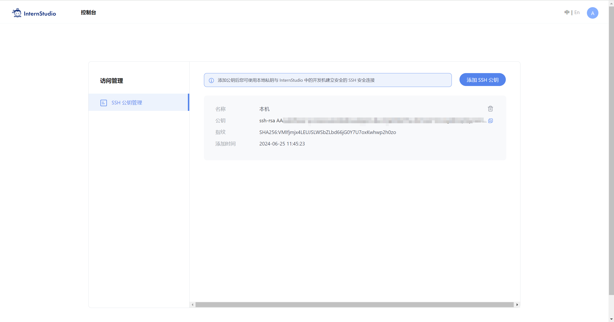

完成上述配置后，我们可以使用SSH远程连接软件，如：**Windterm、Xterminal，Vscode里面插件Remote -SSH**安装插件后可以连接到创建的开发机，直接将开发机的ssh连接命令执行即可。配置文件就选默认的。

**三、端口映射**

**端口映射**是一种网络技术，它可以将外网中的任意端口映射到内网中的相应端口，实现内网与外网之间的通信。通过端口映射，可以在外网访问内网中的服务或应用，实现跨越网络的便捷通信。

因为在后续的课程中我们会进行模型**web_demo**的部署实践，那在这个过程中，很有可能遇到web ui加载不全的问题。这是因为开发机Web IDE中运行web_demo时，直接访问开发机内 http/https 服务可能会遇到代理问题，外网链接的**ui资源**没有被加载完全。

所以为了解决这个问题，我们需要对运行web_demo的连接进行端口映射，将**外网链接映射到我们本地主机**，我们使用本地连接访问，解决这个代理问题。下面让我们实践一下。

我们可以来到开发机这边，点击自定义服务，复制第一条命令，

```Bash
ssh -p 37367 root@ssh.intern-ai.org.cn -CNg -L {本地机器_PORT}:127.0.0.1:{开发机_PORT} -o StrictHostKeyChecking=no
```

介绍一下命令各部分的含义：

> - `-p 37367`：是指定 SSH 连接的端口为 37367，这个前面提到过。
> - `root@ssh.intern-ai.org.cn`：表示要以 `root` 用户身份连接到 `ssh.intern-ai.org.cn` 这个主机。
> - `-CNg`：
>   - `-C` 通常用于启用压缩。
>   - `-N` 表示不执行远程命令，仅建立连接用于端口转发等。
>   - `-g` 允许远程主机连接到本地转发的端口。
> - `-L {本地机器_PORT}:127.0.0.1:{开发机_PORT}`：这是设置本地端口转发，将本地机器的指定端口（由 `{本地机器_PORT}` 表示）转发到远程主机（这里即 `ssh.intern-ai.org.cn`）的 `127.0.0.1` （即本地回环地址）和指定的开发机端口（由 `{开发机_PORT}` 表示）。
> - `-o StrictHostKeyChecking=no`：关闭严格的主机密钥检查，这样可以避免第一次连接时因为未知主机密钥而产生的提示或错误。

这时候我们在开发机中运行一个demo的时候，进行端口映射，在本地打开cmd，执行

```Bash
ssh -p 37367 root@ssh.intern-ai.org.cn -CNg -L 6006:127.0.0.1:6006 -o StrictHostKeyChecking=no
```


注意次命令无任何返回，其实VScode提供了自动端口映射功能，不需要手动配置，使用“Ctrl+Shift+~”快捷键**唤醒终端**，在终端的右侧可以找到端口选项：


这里有一个简单的web_demo的例子，方便大家理解ssh，我们无论是在开发机里面还是本地VScode链接了SSH之后新建一个`hello_world.py`文件，内容如下:

```python
import socket
import re
import gradio as gr
 
# 获取主机名
def get_hostname():
    hostname = socket.gethostname()
    match = re.search(r'-(\d+)$', hostname)
    name = match.group(1)
    
    return name
 
# 创建 Gradio 界面
with gr.Blocks(gr.themes.Soft()) as demo:
    html_code = f"""
            <p align="center">
            <a href="https://intern-ai.org.cn/home">
                
            </a>
            </p>
            <h1 style="text-align: center;">☁️ Welcome {get_hostname()} user, welcome to the ShuSheng LLM Practical Camp Course!</h1>
            <h2 style="text-align: center;">😀 Let’s go on a journey through ShuSheng Island together.</h2>
            <p align="center">
                <a href="https://github.com/InternLM/Tutorial/blob/camp3">
                    
                </a>
            </p>

            """
    gr.Markdown(html_code)

demo.launch()

```


研究上面的代码，需要先使用`pip install gradio==4.29.0`命令安装以下依赖包，然后在Web IDE的终端中运行了一个`hello_world.py`即可。只有进行了端口映射，我们本地才能访问，要不然你直接去书生浦语开发机设备那，连接显示器，用开发机的浏览器访问，哈哈哈😀。

下面是在自己设备里面win+r打开cmd，运行下面命令，**请注意下面的46264端口换成自己ssh里面的端口号，在那个"开发机—SSH连接"里面可以看到自己的端口号，替换下即可😀**。

```python
ssh -p 46264 root@ssh.intern-ai.org.cn -CNg -L 7860:127.0.0.1:7860 -o StrictHostKeyChecking=no
```


**这里我是分开截图的，意思就是我安装gradio交互页面的命令是在Internstudio开发机里面执行，然后运行web_demo是在本地vscode连接ssh之后再终端执行的，本地打开cmd执行上面的命令，然后就在浏览器输入127.0.0.1:7860即可。后面内容我就直接在开发机中操作了，谢谢大家~😀😀**

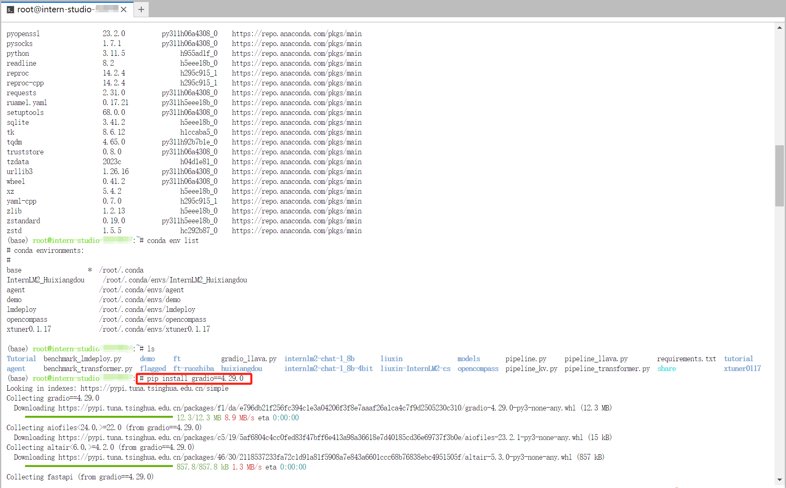

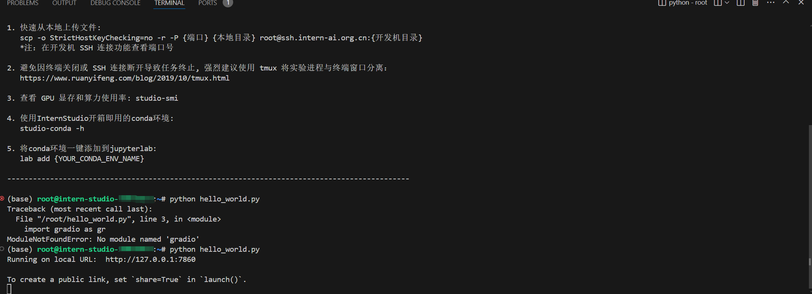

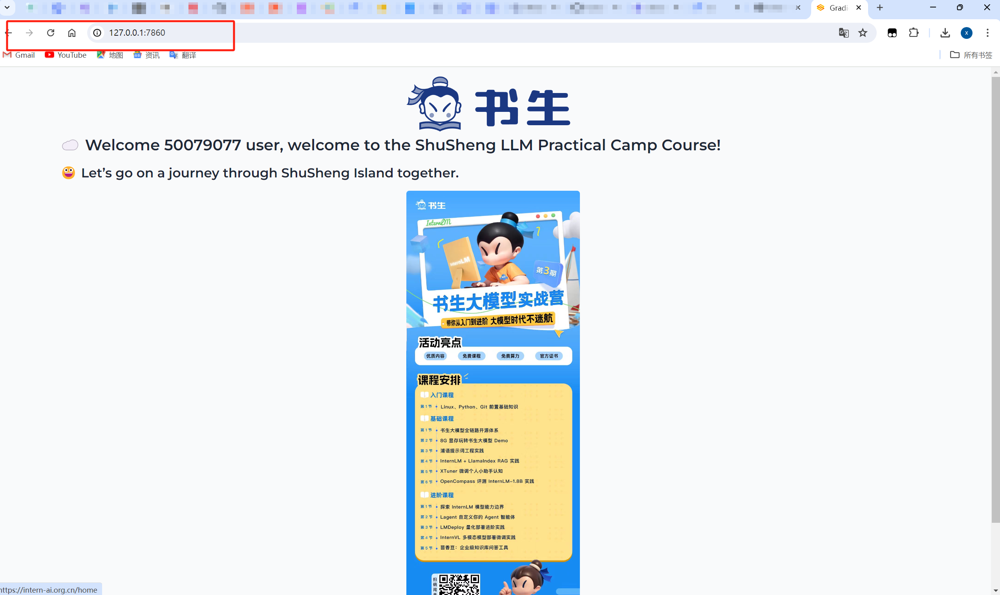

### 1.文件管理

在 Linux 中，常见的文件管理操作包括：

- **创建文件**：可以使用 `touch` 命令创建空文件。
- **创建目录**：使用 `mkdir` 命令。
- **目录切换**：使用`cd`命令。
- **显示所在目录**：使用`pwd`命令。
- **查看文件内容**：如使用 `cat` 直接显示文件全部内容，`more` 和 `less` 可以分页查看。
- **编辑文件**：如 `vi` 或 `vim` 等编辑器。
- **复制文件**：用 `cp` 命令。
- **创建文件链接**：用`ln`命令。
- **移动文件**：通过 `mv` 命令。
- **删除文件**：使用 `rm` 命令。
- **删除目录**：`rmdir`（只能删除空目录）或 `rm -r`（可删除非空目录）。
- **查找文件**：可以用 `find` 命令。
- **查看文件或目录的详细信息**：使用`ls`命令，如使用 `ls -l`查看目录下文件的详细信息。
- > 常用参数及使用方法如下：
  >
  > - `-a`：显示所有文件和目录，包括隐藏文件（以`.`开头的文件或目录）。
  > - `-l`：以长格式显示详细信息，包括文件权限、所有者、大小、修改时间等。
  > - `-h`：与`-l`结合使用，以人类可读的方式显示文件大小（如`K`、`M`、`G`等）。
  > - `-R`：递归列出子目录的内容。
  > - `-t`：按文件修改时间排序显示。
- **处理文件**：进行复杂的文件操作，可以使用`sed`命令。
- > `sed`命令是一种流编辑器，主要用于文本处理，在处理复杂的文件操作时经常用到，在后续的课程中会使用到，`sed`命令常用参数及使用示例如下：
  >
  > - **参数说明：**
  >   - `-e<script>` 或 `--expression=<script>`：直接在命令行中指定脚本进行文本处理。
  >   - `-f<script文件>` 或 `--file=<script文件>`：从指定的脚本文件中读取脚本进行文本处理。
  >   - `-n` 或 `--quiet` 或 `--silent`：仅打印经过脚本处理后的输出结果，不打印未匹配的行。
  > - **动作说明：**
  >   - `a`：在当前行的下一行添加指定的文本字符串。
  >   - `c`：用指定的文本字符串替换指定范围内的行。
  >   - `d`：删除指定的行。
  >   - `i`：在当前行的上一行添加指定的文本字符串。
  >   - `p`：打印经过选择的行。通常与 `-n` 参数一起使用，只打印匹配的行。
  >   - `s`：使用正则表达式进行文本替换。例如，`s/old/new/g` 将所有 "InternLM" 替换为 "InternLM yyds"。
- **文本搜索工具**：grep，常用参数如下
> `-i`：忽略大小写进行搜索。
> `-v`：反转匹配，即显示不匹配的行。
> `-n`：显示行号。
> `-c`：统计匹配的行数。

这里就简单演示几个命令：

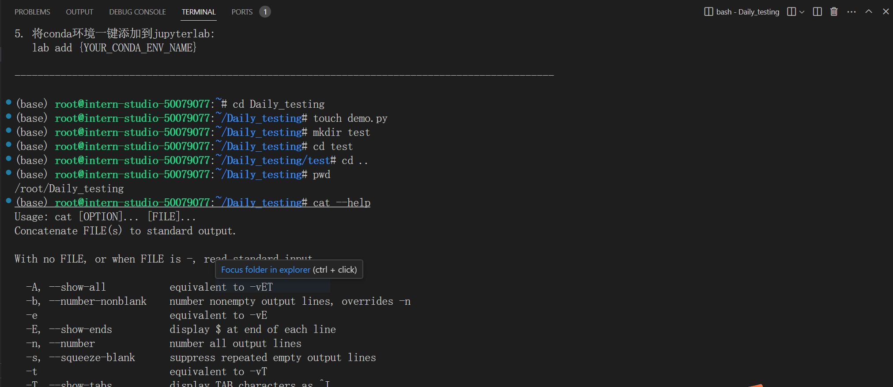

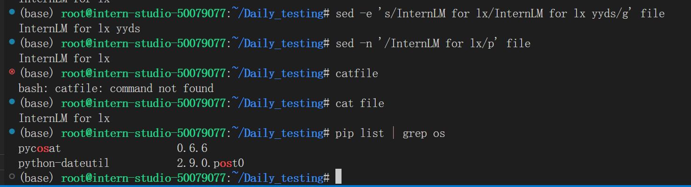

算力ID懒得模糊了，基础不太了解的同学建议多练练手这些简单命令，对了还有个vim or vi命令，这个主要是用来编辑文件的，有时候比如开发机，实验机，或者只支持vi编辑器的，刚开始需要修改配置文件，还是很好用的。下面用官方的图来解释三种模式的关系

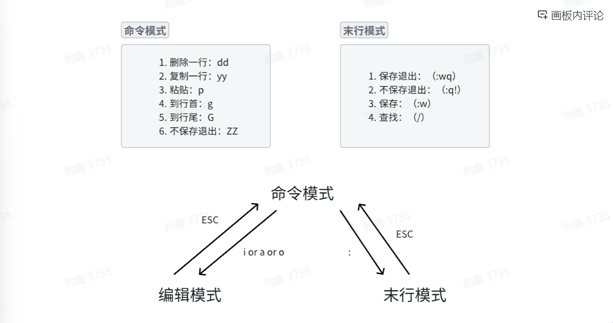

进入编辑模式可以使用`i`，vim的方便之处就是可以在终端进行简单的文件修改。

### 2. 进程管理

**进程管理**命令是进行系统监控和进程管理时的重要工具，常用的进程管理命令有以下几种：

- **ps**：查看正在运行的进程
- **top**：动态显示正在运行的进程
- **pstree**：树状查看正在运行的进程
- **pgrep**：用于查找进程
- **nice**：更改进程的优先级
- **jobs**：显示进程的相关信息
- **bg 和 fg**：将进程调入后台
- **kill**：杀死进程

在开发机中还有一条特殊的命令`nvidia-smi`，它是 NVIDIA 系统管理接口（NVIDIA System Management Interface）的命令行工具，用于监控和管理 NVIDIA GPU 设备。它提供了一种快速查看 GPU 状态、使用情况、温度、内存使用情况、电源使用情况以及运行在 GPU 上的进程等信息的方法。

下面是关于各个命令使用示例：

- `ps`：列出当前系统中的进程。使用不同的选项可以显示不同的进程信息，例如：

  - ```Bash
    ps aux  # 显示系统所有进程的详细信息
    ```

- `top`：动态显示系统中进程的状态。它会实时更新进程列表，显示CPU和内存使用率最高的进程。

  - ```Bash
    top  # 启动top命令，动态显示进程信息
    ```

- `pstree`：以树状图的形式显示当前运行的进程及其父子关系。

  - ```Bash
    pstree  # 显示进程树
    ```

- `pgrep`：查找匹配条件的进程。可以根据进程名、用户等条件查找进程。

  - ```Bash
    pgrep -u username  # 查找特定用户的所有进程
    ```

- `nice`：更改进程的优先级。`nice` 值越低，进程优先级越高。

  - ```Bash
    nice -n 10 long-running-command  # 以较低优先级运行一个长时间运行的命令
    ```

- `jobs`：显示当前终端会话中的作业列表，包括后台运行的进程。

  - ```Bash
    jobs  # 列出当前会话的后台作业
    ```

- `bg` 和 `fg`：`bg` 将挂起的进程放到后台运行，`fg` 将后台进程调回前台运行。

  - ```Bash
    bg  # 将最近一个挂起的作业放到后台运行
    fg  # 将后台作业调到前台运行
    ```

- `kill`：发送信号到指定的进程，通常用于杀死进程。

  - ```Bash
    kill PID  # 杀死指定的进程ID
    ```

  -  注意，`kill` 命令默认发送 `SIGTERM` 信号，如果进程没有响应，可以使用`-9`使用`SIGKILL` 信号强制杀死进程：

  - ```Bash
    kill -9 PID  # 强制杀死进程    
    ```

> `SIGTERM`（Signal Termination）信号是Unix和类Unix操作系统中用于请求进程终止的标准信号。当系统或用户想要优雅地关闭一个进程时，通常会发送这个信号。与`SIGKILL`信号不同，`SIGTERM`信号可以被进程捕获并处理，从而允许进程在退出前进行清理工作。（来源于网络）

以下是 `nvidia-smi` 命令的一些基本命令用法：

- 显示 GPU 状态的摘要信息：

  - ```Bash
    nvidia-smi
    ```

- 显示详细的 GPU 状态信息：

  - ```Bash
    nvidia-smi -l 1
    ```

  -  这个命令会每1秒更新一次状态信息。

- 显示 GPU 的使用历史：

  - ```Bash
    nvidia-smi -h
    ```

- 列出所有 GPU 并显示它们的 PID 和进程名称：

  - ```Bash
    nvidia-smi pmon
    ```

- 强制结束指定的 GPU 进程：

  - ```Bash
    nvidia-smi --id=0 --ex_pid=12345
    ```

  -  这会强制结束 GPU ID 为 0 上的 PID 为 12345 的进程。

- 设置 GPU 性能模式：

  - ```Bash
    nvidia-smi -pm 1
    nvidia-smi -i 0 -pm 1
    ```

  -  第一个命令会为所有 GPU 设置为性能模式，第二个命令只针对 ID 为 0 的 GPU。

- 重启 GPU：

  - ```Bash
    nvidia-smi --id=0 -r
    ```

  -  这会重启 ID 为 0 的 GPU。

- 显示帮助信息：

  - ```Bash
    nvidia-smi -h
    ```

下面通过一张图片对GPU信息进行介绍

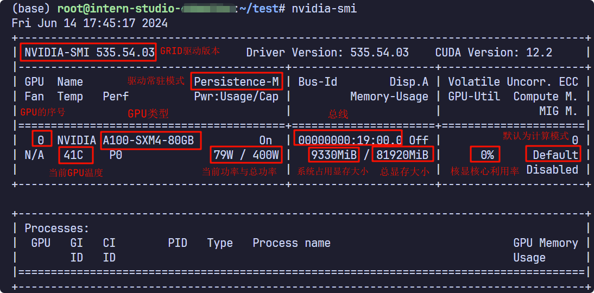

### 3.**工具使用**

这里介绍一个工具`TMUX`，`TMUX` 是一个终端多路复用器。它可以在多个终端之间轻松切换，分离它们（这不会杀死终端，它们继续在后台运行）和将它们重新连接到其他终端中。为什么要介绍这个工具呢？因为在后面进行`Xtuner`微调模型的时候，时间会很长，使用`Tmux`可以解决程序被杀死中断的情况，下面介绍一下如何安装并使用。

因为开发机使用的是ubuntu的操作系统，可以使用`lsb_release -a` 命令查看ubuntu的系统信息：

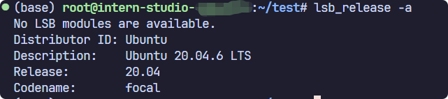

然后使用`apt install tmux`命令安装tmux，安装完成以后可以使用`tmux`命令就可以使用tmux了，如果想退出tmux可以使用“**Ctrl+d**”快捷键。

> 因为开发机不支持持久化的应用安装，所以每次重启开发机都需要重新安装，因为开发机是一个docker容器。

这里推荐查看使用方法如下：

[Tmux使用教程](https://www.ruanyifeng.com/blog/2019/10/tmux.html)

## 四、Conda和Shell介绍

Conda 是一个开源的包管理和环境管理系统，可在 Windows、macOS 和 Linux 上运行。它快速安装、运行和更新软件包及其依赖项。使用 Conda，您可以轻松在本地计算机上创建、保存、加载和切换不同的环境。

在开发机中已经安装了`conda`，我们可以直接使用，而且开发机中也有内置的`conda`命令`studio-conda`，下面我们会介绍`conda`的基本使用，还有`studio-conda`的使用方法以及介绍一下`studio-conda`是怎么实现的。

我们会从下面几部分进行介绍：

> 1. conda设置
> 2. conda环境管理
> 3. conda和pip
> 4. studio-conda使用与Shell（扩展）

### 1.conda设置

我们可以使用`conda --version`来查看当前开发机中`conda`的版本信息，如果我们想要查看conda的配置信息可以使用`conda config --show`命令，如果是开发机默认的设置的话会返回：（一部分信息）：

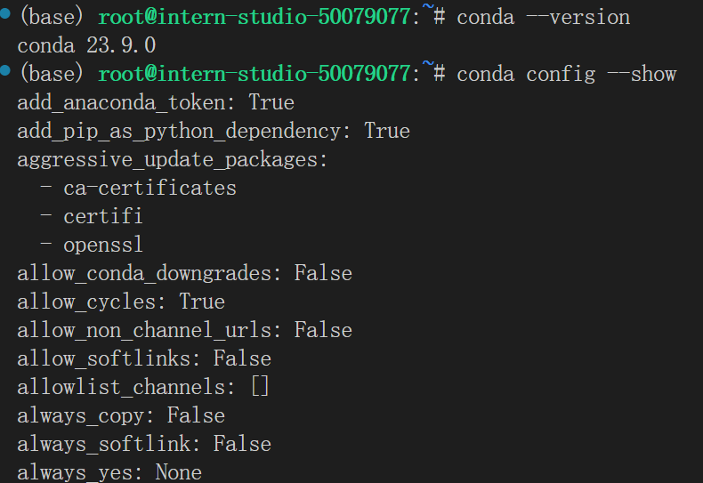

 当我们要使用`conda`安装包的时候会非常慢，我们可以设置国内镜像提升安装速度，示例如下：

```Bash
#设置清华镜像
conda config --add channels https://mirrors.tuna.tsinghua.edu.cn/anaconda/pkgs/main
conda config --add channels https://mirrors.tuna.tsinghua.edu.cn/anaconda/pkgs/free
conda config --add channels https://mirrors.tuna.tsinghua.edu.cn/anaconda/pkgs/r
conda config --add channels https://mirrors.tuna.tsinghua.edu.cn/anaconda/pkgs/pro
conda config --add channels https://mirrors.tuna.tsinghua.edu.cn/anaconda/pkgs/msys2
```

但是我们一般都是使用`pip`进行包的安装的，后面我们会介绍`pip`和`conda`的区别。

 这些配置在`Conda`环境配置中，会影响软件包的安装、更新、环境管理等操作的方式和结果。 

 ### 2. conda环境管理

这一部分是`conda`中非常重要的一部分，掌握了这一部分大家就可以将开发环境玩转到飞起了😀。

#### 2.1 创建虚拟环境

我们可以使用`conda create -n name python``=3.10`创建虚拟环境，这里表示创建了python版本为3.10、名字为name的虚拟环境。创建后，可以在`.conda`目录下的`envs`目录下找到。


在不指定python版本时，会自动创建基于最新python版本的虚拟环境。同时我们可以在创建虚拟环境的同时安装必要的包：`conda create -n name numpy matplotlib python=3.10`（但是不建议大家这样用）

创建虚拟环境的常用参数如下：

- -n 或 --name：指定要创建的环境名称。
- -c 或 --channel：指定额外的软件包通道。
- --clone：从现有的环境克隆来创建新环境。
- -p 或 --prefix：指定环境的安装路径（非默认位置）。

#### 2.2 查看有哪些虚拟环境

如果想要查看有哪些虚拟环境我们可以使用下面的命令：

```Bash
conda env list
conda info -e
conda info --envs
```

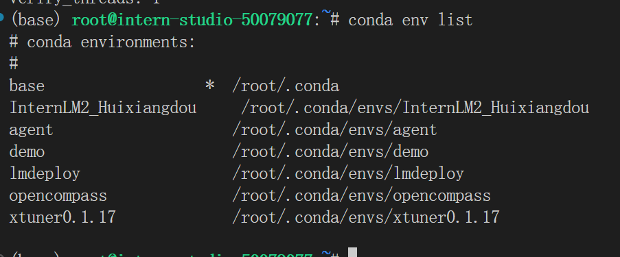

同时我们还可以看到环境所在的目录。

#### 2.3 激活与退出虚拟环境

当我们创建完虚拟环境后我们可以使用`conda activate name`命令来激活虚拟环境，如何查看是否切换成功呢？很简单，只需要看`(base)`是否变成了创建的虚拟环境的名称。


 如果想要退出虚拟环境的话可以使用：

```python
conda activate
conda deactivate
```

 这两条命令都会回到`base`环境，因为`base`是conda的基础环境，如果仔细观察的话，`base`环境目录比其他的虚拟环境目录层级要高。

#### 2.4 删除与导出虚拟环境

如果想要删除某个虚拟环境可以使用`conda remove --name name --all`，如果只删除虚拟环境中的某个或者某些包可以使用`conda remove --name name  package_name`

导出虚拟环境对于特定的环境是非常有必要的，因为有些软件包的依赖关系很复杂，如果自己重新进行创建和配置的话很麻烦，如果我们将配置好的环境导出，这样下次使用还原就行了，而且也可以把配置分享给其他人。

```Bash
#获得环境中的所有配置
conda env export --name myenv > myenv.yml
#重新还原环境
conda env create -f  myenv.yml
```

比如我们将`xtuner0.1.17`虚拟环境导出，配置信息是这样的：

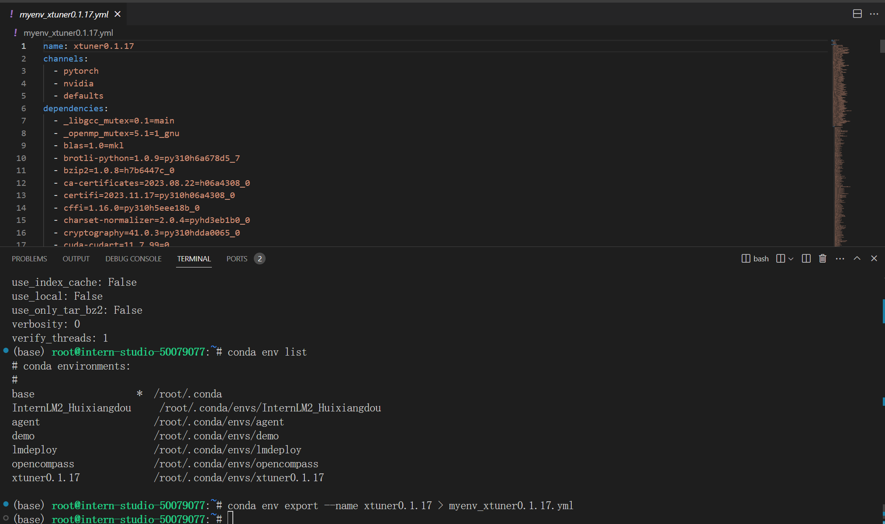

其中包括**环境名字**、**虚拟环境软件包的在线存储库的位置**和**虚拟环境的依赖**。后面我们会使用进阶的使用方法来快速的还原虚拟环境。

### 3. conda和pip

这部分我们介绍一些`conda`和`pip`的一些区别：

> 1. conda可以管理非python包，pip只能管理python包。
> 2. conda可以用来创建虚拟环境，pip不能，需要依赖virtualenv之类的包。
> 3. conda安装的包是编译好的**二进制文件**，安装包文件过程中会自动安装依赖包；pip安装的包是**wheel或源码**，装过程中不会去支持python语言之外的依赖项。
> 4. conda安装的包会统一下载到当前虚拟环境对应的目录下，下载一次多次安装。pip是直接下载到对应环境中。
>

> **Wheel** 是一种 Python 安装包的格式。
>
> 它是一种预编译的二进制分发格式，类似于 conda 中的已编译二进制文件。
>
> Wheel 格式的主要优点包括：
>
> 1. 安装速度快：因为已经进行了预编译，所以在安装时不需要像源码安装那样进行编译过程，节省了时间。
> 2. 一致性：确保在不同的系统和环境中安装的结果是一致的。
>
> 例如，如果您要安装一个大型的 Python 库，使用 Wheel 格式可以避免在不同的机器上因为编译环境的差异而导致的安装问题。而且，对于那些没有编译环境或者编译能力较弱的系统，Wheel 格式能够让安装过程更加顺畅。

### 4. studio-conda使用与Shell（扩展，不需要在开发机中操作）

这一部分属于扩展的部分，因为我觉得这一部分非常有趣，也非常实用，所以如果大家有兴趣的可以学习一下。

我们先来介绍一下`studio-conda`，这是开发机内置的一个命令，它通过Shell脚本来实现的。什么是Shell脚本呢？

> **Shell 脚本** 是一种包含一系列命令的文本文件，这些命令按照特定的顺序排列，用于在 Unix/Linux 或类似的操作系统环境中自动执行任务。
>
> Shell 脚本通常使用 Shell 语言编写，常见的 Shell 语言如 Bash、Sh 等，就是我们前面所介绍了Linux基础命令，这就属于Shell语言。
>
> 它有以下几个重要特点：
>

> 1. **自动化**：可以将一系列重复、复杂的操作编写为一个脚本，然后只需运行脚本即可自动完成这些操作，从而节省时间和减少错误。例如，每天定时备份重要文件的脚本。
> 2. **系统管理**：用于管理系统配置、用户权限、进程控制等。比如，创建新用户并设置其权限的脚本。
> 3. **批处理**：能够同时处理多个文件或数据。例如，将一批图片文件从一种格式转换为另一种格式的脚本。
> 4. **流程控制**：像条件判断（if-else）、循环（for、while）等，使脚本能够根据不同的情况执行不同的操作。
>

那`studio-conda`就属于自动化的一部分，在我们开发机中root用户的bash环境的配置文件是`.bashrc`，但其实主要的配置文件是`/share/.aide/config/bashrc`，在这个文件里面写了一些命令，可以让我们更快捷的执行一些操作，比如：

```python
export no_proxy='localhost,127.0.0.1,0.0.0.0,172.18.47.140'
export PATH=/root/.local/bin:$PATH
export HF_ENDPOINT='https://hf-mirror.com'
alias studio-conda="/share/install_conda_env.sh"
alias studio-smi="/share/studio-smi"
```

`export`是用来设置环境变量的，`alias`是将一个sh文件复制为一个变量，这个可以作为命令在终端中执行，我们的`studio-conda`就是这样的。

> 这里的studio-smi是用来查看查看虚拟内存占用的，当我们打开`/share/studio-smi`文件可以看到：
>
> ```Bash
> #!/bin/bash
> 
> if command -v vgpu-smi &> /dev/null
> then
>     echo "Running studio-smi by vgpu-smi"
>     vgpu-smi
> else
>     echo "Running studio-smi by nvidia-smi"
>     nvidia-smi
> fi
> ```
>
> 这个脚本是用于检查系统中是否存在 `vgpu-smi` 命令，如果存在，它将运行 `vgpu-smi` 来显示虚拟 GPU (vGPU) 的状态信息；如果不存在，它将运行 `nvidia-smi` 来显示 NVIDIA GPU 的状态信息。如下图所示：
>
> 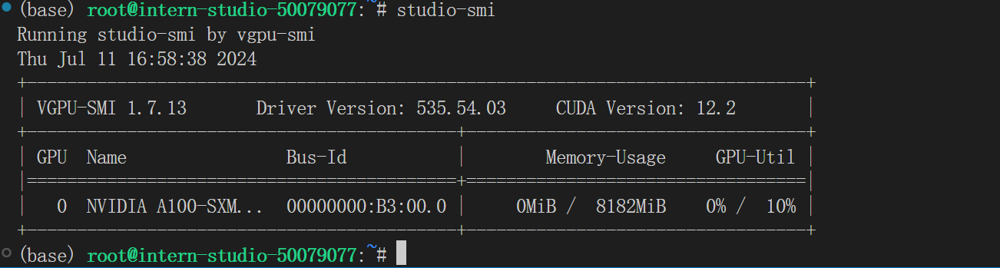
>
> `nvidia-smi` 是用于监控和管理物理 NVIDIA GPU 设备的工具，而 `vgpu-smi` 专门用于监控和管理通过 NVIDIA vGPU 技术虚拟化的 GPU 资源。

我们查看`/share/install_conda_env.sh`文件内容如下：

```Bash
#!/bin/bash
# clone internlm-base conda env to user's conda env
# created by xj on 01.07.2024
# modifed by xj on 01.19.2024 to fix bug of conda env clone
# modified by ljy on 01.26.2024 to extend

XTUNER_UPDATE_DATE=`cat /share/repos/UPDATE | grep xtuner |awk -F= '{print $2}'`
HOME_DIR=/root
CONDA_HOME=$HOME_DIR/.conda
SHARE_CONDA_HOME=/share/conda_envs
SHARE_HOME=/share

list() {
    cat <<-EOF
  预设环境          描述

  internlm-base    pytorch:2.0.1, pytorch-cuda:11.7
  xtuner           Xtuner(源码安装: main $(echo -e "\033[4mhttps://github.com/InternLM/xtuner/tree/main\033[0m"), 更新日期：$XTUNER_UPDATE_DATE)
  pytorch-2.1.2    pytorch:2.1.2, pytorch-cuda:11.8
EOF
}

help() {
    cat <<-EOF
  说明: 用于快速clone预设的conda环境

  使用: 
  
    1. studio-conda env -l/list 打印预设的conda环境列表
  
    2. studio-conda <target-conda-name> 快速clone: 默认拷贝internlm-base conda环境
    
    3. studio-conda -t <target-conda-name> -o <origin-conda-name> 将预设的conda环境拷贝到指定的conda环境
        
EOF
}

clone() {
    source=$1
    target=$2

    if [[ -z "$source" || -z "$target" ]]; then
        echo -e "\033[31m 输入不符合规范 \033[0m"
        help
        exit 1
    fi

    if [ ! -d "${SHARE_CONDA_HOME}/$source" ]; then
        echo -e "\033[34m 指定的预设环境: $source不存在\033[0m"
        list
        exit 1
    fi

    if [ -d "${CONDA_HOME}/envs/$target" ]; then
        echo -e "\033[34m 指定conda环境的目录: ${CONDA_HOME}/envs/$target已存在, 将清空原目录安装 \033[0m"
        wait_echo&
        wait_pid=$!
        rm -rf "${CONDA_HOME}/envs/$target"
        kill $wait_pid
    fi

    echo -e "\033[34m [1/2] 开始安装conda环境: <$target>. \033[0m"
    sleep 3
    tar --skip-old-files -xzvf /share/pkgs.tar.gz -C ${CONDA_HOME}
    wait_echo&
    wait_pid=$!
    conda create -n $target --clone ${SHARE_CONDA_HOME}/${source}
    if [ $? -ne 0 ]; then
        echo -e "\033[31m 初始化conda环境: ${target}失败 \033[0m"
        exit 10
    fi

    kill $wait_pid

    # for xtuner, re-install dependencies
    case "$source" in
    xtuner)
        source_install_xtuner $target
        ;;
    esac

    echo -e "\033[34m [2/2] 同步当前conda环境至jupyterlab kernel \033[0m"
    lab add $target
    source $CONDA_HOME/bin/activate $target
    cd $HOME_DIR

    echo -e "\033[32m conda环境: $target安装成功! \033[0m"

    echo """
    ============================================
                    ALL DONE!
    ============================================
    """
}

······
dispatch $@
```

其中的*`list`*`()`等，都是`studio-conda`的函数，可以实现某些操作，比如我们可以使用`studio-conda env list`来查看预设的环境：

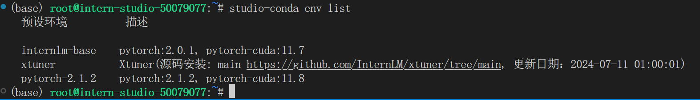U0tpV2JvaGF1bzA0cEx4UmxOVGNkYzJwbkJlXzE3MjA2ODgzODQ6MTcyMDY5MTk4NF9WNA)

其中*`clone`*`()`函数的主要作用就是用来复制环境的，不过只能从预设的环境中进行复制，主要的代码其实就是：

```Bash
tar --skip-old-files -xzvf /share/pkgs.tar.gz -C ${CONDA_HOME}

conda create -n $target --clone ${SHARE_CONDA_HOME}/${source}
```

解压预设环境的压缩包，然后通过clone创建虚拟环境，不过在Shell脚本中还设置了一些逻辑，不过都是一些判断，如果你熟悉任何一种编程语言应该都可以看懂，如果看不懂问题也不大。

那么我们如何将我们自己创建的环境添加到`studio-conda`中呢？

> 第一步，将新的conda环境创建到/share/conda_envs下
>
> > conda create -p /share/conda_envs/xxx python=3.1x
>
> 第二步，将本机/root/.conda/pkgs下的文件拷贝到/share/pkgs中，重新压缩并替换(此步骤是为了把conda创建过程中大的公共包存储起来，避免重复下载)
>
> > cp -r -n /root/.conda/pkgs/* /share/pkgs/
> >
> > cd /share && tar -zcvf pkgs.tar.gz pkgs
>
> 第三步，更新install_conda_env.sh中的list函数，增加新的conda环境说明。
>

上面是开发机默认提供的方法，其实还有一种方法，我们前面使用`conda`导出过`xtuner0.1.17`虚拟环境的配置文件，我们可以使用`conda env create -f xtuner0.1.17.yml`命令来还原虚拟环境。下面我们来写一个简单的Shell脚本来实现这个操作：我们在根目录下创建`test.sh`文件，写入以下内容：

```Bash
#!/bin/bash

# 定义导出环境的函数
export_env() {
    local env_name=$1
    echo "正在导出环境: $env_name"
    # 导出环境到当前目录下的env_name.yml文件
    conda env export -n "$env_name" > "$env_name.yml"
    echo "环境导出完成。"
}

# 定义还原环境的函数
restore_env() {
    local env_name=$1
    echo "正在还原环境: $env_name"
    # 从当前目录下的env_name.yml文件还原环境
    conda env create -n "$env_name" -f "$env_name.yml"
    echo "环境还原完成。"
}

# 检查是否有足够的参数
if [ $# -ne 2 ]; then
    echo "使用方法: $0 <操作> <环境名>"
    echo "操作可以是 'export' 或 'restore'"
    exit 1
fi

# 根据参数执行操作
case "$1" in
    export)
        export_env "$2"
        ;;
    restore)
        restore_env "$2"
        ;;
    *)
        echo "未知操作: $1"
        exit 1
        ;;
esac
```

当我们完成Shell脚本的创建以后我们需要为脚本赋予权限，可以使用命令：`chmod +x test.sh` ，然后输入`./test.sh restore xtuner0.1.17`并按下回车就可以还原虚拟环境了。(这里本地已经存在该环境了)

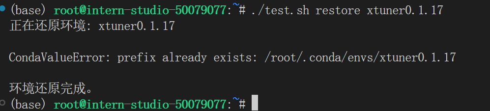

不过这种跟直接使用没什么太大区别，如果将这种操作与开发机中的`studio-conda`命令结合起来会非常方便，不过由于复制环境的方法不太一样。所以如果要实现需要对`/share/install_conda_env.sh`文件的逻辑进行修改。

### 总结

​       这节课知识点重点在基础知识的理解和运用，整个流程也比较简单，希望同学们可以自己多熟悉linux命令和InternStudio开发机，毕竟熟练度上来了，方便后续的学习😀😀😀。